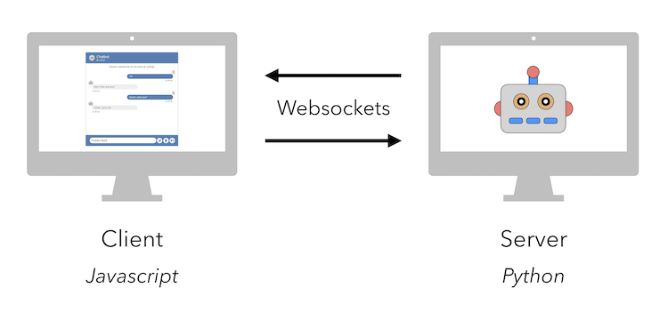
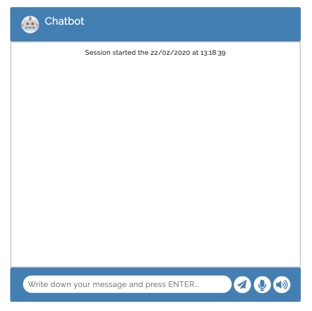

# Chatbot
Template for a conversational agent. The server-side is written in python (using [Rasa](https://rasa.com/)) and the client-side is written in javascript. The communication is handled by a [websockets protocol](https://en.wikipedia.org/wiki/WebSocket).

<p align="center">
    
</p>

## Installation

To install the dependencies, run the following command:

```bash
pip install -r requirements.txt
```

If using Conda, you can also create an environment with the requirements:

```bash
conda env create -f environment.yml
```

By default the environment name is `chatbot`. To activate it run:

```bash
conda activate chatbot
```

## Usage

To run the chatbot, open two different terminals and run the following commands:

```bash
# Terminal 1: Run the server
python server/server.py
```

```bash
# Terminal 2: Open the client
./client/client.sh
```

Browse the website given by the client. The chatbot includes speech recognition and text-to-speech.

<p align="center">
    
</p>

